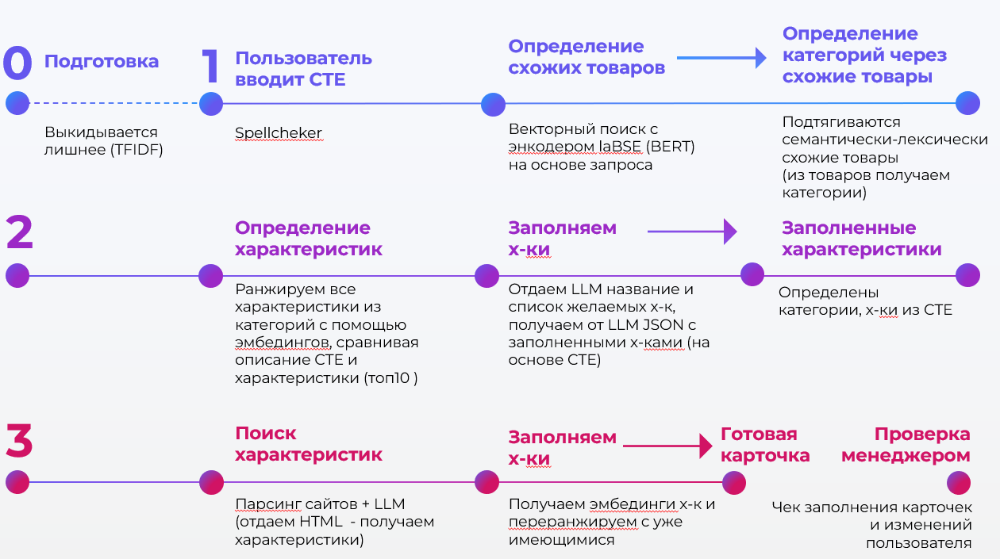
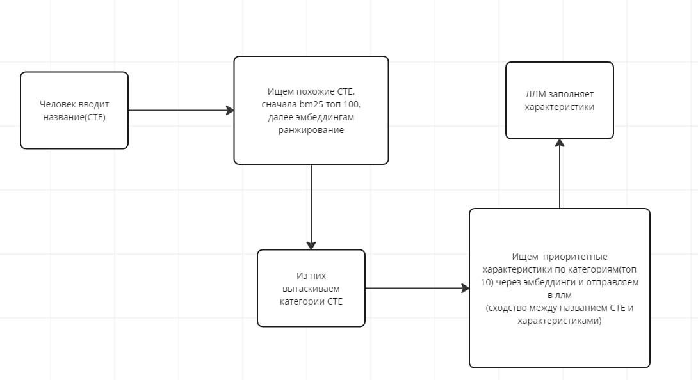
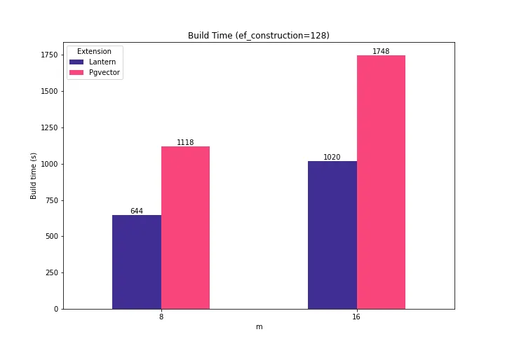
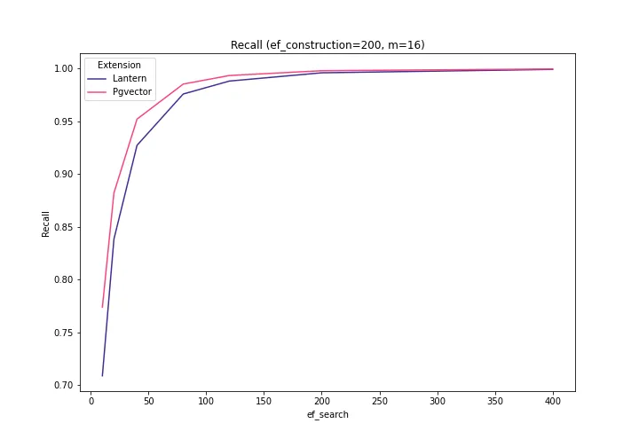

# hacktender

Решение для задачи: СОЗДАНИЕ ФУНКЦИОНАЛА ГЕНЕРАЦИИ НАИМЕНОВАНИЯ И ХАРАКТЕРИСТИК СТЕ В УНИВЕРСАЛЬНОМ ВИДЕ


Описания проектов находятся в корне папок, в проектах, в файлах Readme.md.

frontend - web страница с тестированием поиска

model - модельки и ноутбки работы с модельками

parser - парсер для забора характеристик с разных сайтов

# Сайтик
https://zakupki.kovalev.team/home

Поставщик: 
login: provider password: zak1
Менеджер: 
login: manager password: zak2

# Pipeline работы системы


# Запрос характеристик подробнее

## База данных
Postgresql с расширением lantern. Для хранения веткоров и эффективного векторного поиска



Для работы эффективного поиска создаются индексы из lantern, все индексы отражены на схеме [Schema](db/schema.rb) 


# Encoder
Для векторного поиска используется отдельный сервис енкодер написаный на python, который принимает на вход текст и возвращает векторное представление. см подробнее в проекте zakupki_encoder.
## Сервис Кодирования Текста в Вектор

Это Flask-приложение предоставляет API-сервис для кодирования текстов в векторы с использованием модели "cointegrated_LaBSE-en-ru" из библиотеки Sentence Transformers. Оно разработано для поддержки как английского, так и русского языков, что делает его особенно полезным для двуязычных или многоязычных приложений в области обработки естественного языка, поиска и аналогичных направлений.

## Особенности

- Кодирование текста через REST API, возвращающее закодированный вектор в виде строки.
- Поддержка английского и русского текстов через модель "cointegrated_LaBSE-en-ru" из библиотеки Sentence Transformers.
- Обработка ошибок для запросов без текста или в случае сбоя при кодировании.

## Требования

Приложение зависит от следующих пакетов:
- Flask
- Sentence Transformers
- NumPy

Вы можете установить эти зависимости с помощью pip:

## Использование

```POST /encode```

BODY
``` json
{
    "text": "Ноутбук HP"
}
```

ОТВЕТ

``` json
<ВЕКТОР>
```
# LLM
Подробнее смотри в проекте zakupki_llm Для заполнения характеристик используется LLM. Мы берем заранее отобранные топ харакеристик и отправляем их в llm для того что бы заполнить значения характеристик исходя из названия СТЕ
# Генератор Характеристик Товаров

Это Flask-приложение генерирует характеристики для товаров на основе их названий, используя предварительно обученную трансформерную модель. Оно разработано для предоставления быстрых и точных описаний товаров для решения кейса хакатона

## Особенности

- Генерация характеристик товаров с использованием трансформерной модели `IlyaGusev/saiga_mistral_7b`.
- Обработка запросов на генерацию характеристик через простой HTTP POST запрос.
- Возможность обработки нескольких характеристик за один запрос.
- Использование двух DataFrame Pandas для загрузки названий товаров и их характеристик из файлов `.parquet`.

## Установка

``` pip instsall -r ./requirmets.txt```

## Использование

```POST localhost:50001/generate_characteristics```

BODY
``` json
{
    "properties": [{"name": "Диагональ", "id": 12}, {"name": "Объем hdd", "id": 13}, {"name": "Производитель", "id": 15}],
    "name": "Ноутбук HP 250GB 5Z215ES, 15.6"
}
```

ОТВЕТ

``` json
[
    {
        "characteristics": "Диагональ",
        "id": 12,
        "value": "15.6"
    },
    {
        "characteristics": "Объем hdd",
        "id": 13,
        "value": "250 GB"
    },
    {
        "characteristics": "Производитель",
        "id": 15,
        "value": "HP"
    }
]
```
